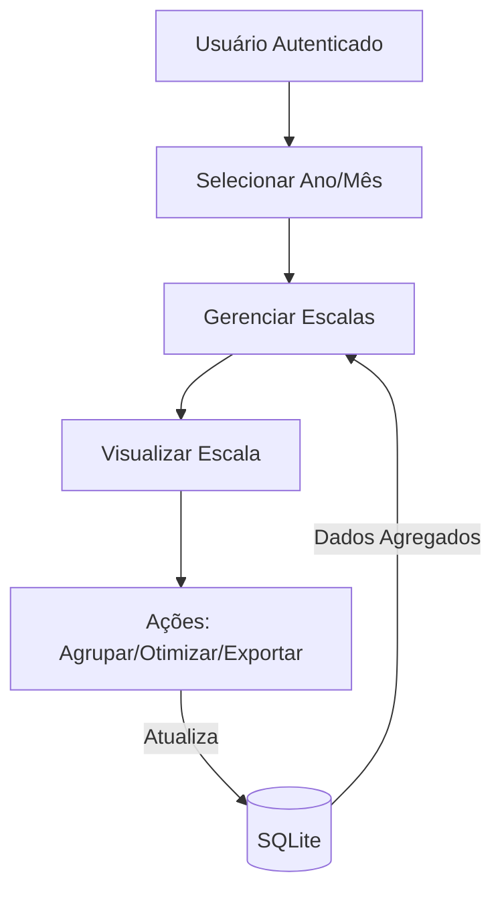

# Arquitetura Geral

## Visão da Aplicação

A aplicação segue a arquitetura padrão do Django, dividindo responsabilidades em apps específicos:

- **core**: Modelos e utilitários compartilhados (serviços, tarifários, processamento de planilhas).
- **escalas**: Fluxo operacional principal para criação, agrupamento, otimização e exportação de escalas.
- **authentication**: Controle de acesso e fluxo de login.

A renderização das telas é realizada por templates Bootstrap, com interação adicional em JavaScript para recursos como o kanban de vans e modais de confirmação.

## Camadas Principais

1. **Apresentação**: Templates HTML e arquivos estáticos (CSS/JS) em `templates/` e `static/`.
2. **Aplicação**: Views baseadas em classe (`escalas/views.py`) que orquestram consultas otimizadas, prefetches e lógicas de negócio.
3. **Serviços**: Módulos especializados (`escalas/services.py`, `core/processors.py`) responsáveis por regras complexas como importação de planilhas ou algoritmos de otimização.
4. **Persistência**: Banco SQLite (`db.sqlite3`) com modelos definidos em `core/models.py` e `escalas/models.py`.

## Fluxo de Dados Simplificado

## Integrações Internas

- **Cache**: Utilização do cache local (`LocMemCache`) para sessões e otimizações rápidas.
- **Arquivos Estáticos**: Servidos via WhiteNoise em produção.
- **Documentação**: MkDocs para publicação da pasta `docs/`.

Para um detalhamento visual mais amplo consulte os [diagramas](diagrams/README.md).
