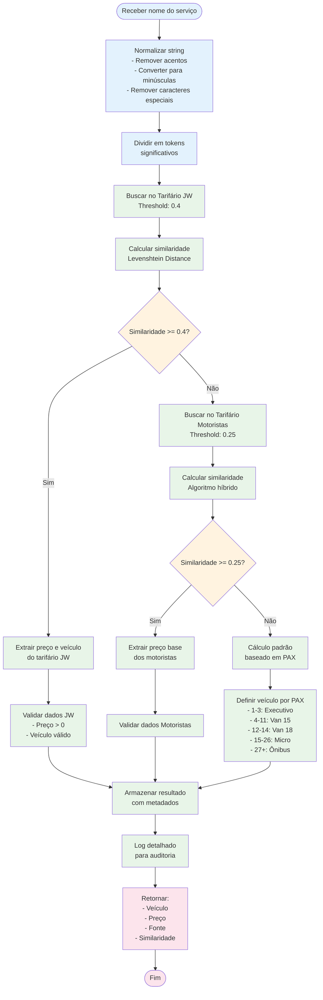
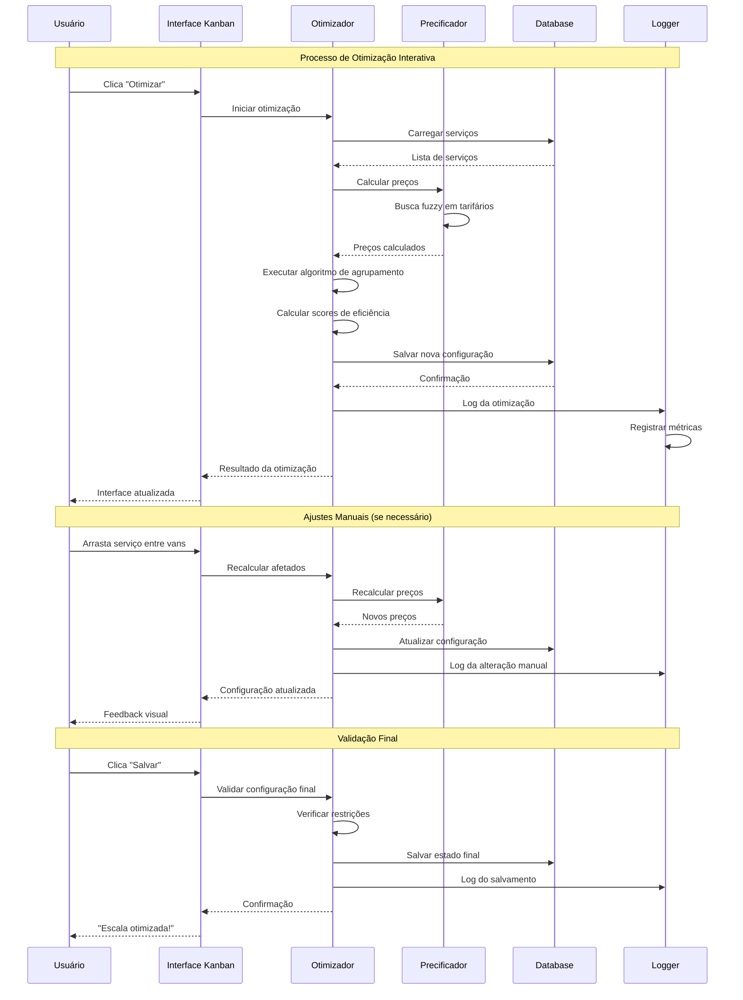

# 🧮 Algoritmos e Lógica de Negócio

Este documento detalha os algoritmos especializados e a lógica de negócio do sistema.

## 🔍 Algoritmo de Busca Fuzzy para Precificação



## 🎯 Algoritmo de Agrupamento Inteligente

```mermaid
flowchart TD
    START([Lista de serviços]) --> SORT_PRIORITY[Ordenar por prioridade<br/>1. Hotelbeds/Holiday<br/>2. Barra da Tijuca<br/>3. Outros clientes]
    
    SORT_PRIORITY --> INIT_GROUPS[Inicializar grupos vazios<br/>Van1: []<br/>Van2: []]
    
    INIT_GROUPS --> LOOP_START{Há serviços<br/>não processados?}
    
    LOOP_START -->|Sim| GET_NEXT[Pegar próximo serviço<br/>da lista ordenada]
    
    GET_NEXT --> CHECK_SIMILAR[Buscar grupos similares<br/>- Mesmo cliente<br/>- Horário próximo (35min)<br/>- Local pickup similar]
    
    CHECK_SIMILAR --> SIMILAR_FOUND{Grupo similar<br/>encontrado?}
    
    SIMILAR_FOUND -->|Sim| CHECK_CAPACITY[Verificar capacidade<br/>PAX atual + novo <= 40]
    SIMILAR_FOUND -->|Não| CREATE_NEW_GROUP[Criar novo grupo]
    
    CHECK_CAPACITY --> CAN_FIT{Pode adicionar<br/>ao grupo?}
    
    CAN_FIT -->|Sim| ADD_TO_GROUP[Adicionar ao grupo<br/>existente]
    CAN_FIT -->|Não| CREATE_NEW_GROUP
    
    CREATE_NEW_GROUP --> CHOOSE_VAN[Escolher van<br/>- Van com menor PAX<br/>- Considerar restrições]
    
    ADD_TO_GROUP --> UPDATE_TOTALS[Atualizar totais<br/>- PAX total<br/>- Valor total<br/>- Horário médio]
    CHOOSE_VAN --> UPDATE_TOTALS
    
    UPDATE_TOTALS --> CALC_EFFICIENCY[Calcular eficiência<br/>Score = PAX/Van + Valor/PAX]
    
    CALC_EFFICIENCY --> LOOP_START
    
    LOOP_START -->|Não| OPTIMIZE_GROUPS[Otimizar grupos<br/>- Balancear PAX<br/>- Maximizar eficiência]
    
    OPTIMIZE_GROUPS --> VALIDATE_RESULT[Validar resultado<br/>- Todos serviços alocados<br/>- Restrições respeitadas]
    
    VALIDATE_RESULT --> SAVE_GROUPS[Salvar grupos<br/>no banco de dados]
    
    SAVE_GROUPS --> END([Grupos criados])
    
    classDef input fill:#e3f2fd
    classDef process fill:#e8f5e8
    classDef decision fill:#fff3e0
    classDef output fill:#fce4ec
    
    class START,SORT_PRIORITY,INIT_GROUPS,GET_NEXT,CHECK_SIMILAR,ADD_TO_GROUP,CREATE_NEW_GROUP,CHOOSE_VAN,UPDATE_TOTALS,CALC_EFFICIENCY,OPTIMIZE_GROUPS,VALIDATE_RESULT,SAVE_GROUPS input
    class LOOP_START,SIMILAR_FOUND,CHECK_CAPACITY,CAN_FIT decision
    class END output
```

## 📊 Cálculo de Lucratividade

```mermaid
flowchart TD
    START([Escala otimizada]) --> GET_ALLOCATIONS[Obter todas as alocações<br/>da escala]
    
    GET_ALLOCATIONS --> LOOP_ALLOC{Para cada alocação}
    
    LOOP_ALLOC --> GET_PRICE[Obter preço calculado<br/>do serviço]
    
    GET_PRICE --> GET_COST[Estimar custo operacional<br/>- Combustível<br/>- Motorista<br/>- Manutenção<br/>- Pedágio]
    
    GET_COST --> CALC_MARGIN[Calcular margem<br/>Margem = (Preço - Custo) / Preço]
    
    CALC_MARGIN --> CALC_PAX_RATIO[Calcular ratio PAX<br/>Eficiência = Preço / PAX]
    
    CALC_PAX_RATIO --> SCORE_SERVICE[Score do serviço<br/>Score = Margem × Eficiência]
    
    SCORE_SERVICE --> STORE_METRICS[Armazenar métricas<br/>no banco]
    
    STORE_METRICS --> LOOP_ALLOC
    
    LOOP_ALLOC -->|Fim| CALC_VAN_TOTALS[Calcular totais por van<br/>- PAX total<br/>- Valor total<br/>- Margem média]
    
    CALC_VAN_TOTALS --> CALC_EFFICIENCY[Calcular eficiência<br/>- Ocupação média<br/>- Valor por KM<br/>- Tempo de operação]
    
    CALC_EFFICIENCY --> GENERATE_INSIGHTS[Gerar insights<br/>- Van mais lucrativa<br/>- Serviços críticos<br/>- Oportunidades]
    
    GENERATE_INSIGHTS --> CREATE_REPORT[Criar relatório<br/>de lucratividade]
    
    CREATE_REPORT --> END([Análise concluída])
    
    classDef input fill:#e3f2fd
    classDef calculation fill:#e8f5e8
    classDef analysis fill:#fff3e0
    classDef output fill:#fce4ec
    
    class START,GET_ALLOCATIONS,GET_PRICE,GET_COST,STORE_METRICS input
    class CALC_MARGIN,CALC_PAX_RATIO,SCORE_SERVICE,CALC_VAN_TOTALS,CALC_EFFICIENCY calculation
    class LOOP_ALLOC,GENERATE_INSIGHTS analysis
    class CREATE_REPORT,END output
```

## 🔄 Processo de Otimização Contínua



## 🎲 Algoritmo de Distribuição de PAX

```mermaid
graph TD
    START([Serviços agrupados]) --> CALC_TOTAL[Calcular PAX total<br/>por grupo]
    
    CALC_TOTAL --> VAN_CAPACITY[Definir capacidades<br/>Van1: 40 PAX<br/>Van2: 40 PAX]
    
    VAN_CAPACITY --> SORT_GROUPS[Ordenar grupos por<br/>PAX decrescente]
    
    SORT_GROUPS --> INIT_VANS[Inicializar vans<br/>Van1: 0 PAX<br/>Van2: 0 PAX]
    
    INIT_VANS --> LOOP{Para cada grupo}
    
    LOOP --> CHECK_V1[Van1 comporta<br/>este grupo?]
    
    CHECK_V1 -->|Sim| CHECK_V2[Van2 comporta<br/>este grupo?]
    CHECK_V1 -->|Não| CHECK_V2_ONLY[Apenas Van2<br/>comporta?]
    
    CHECK_V2 -->|Sim| COMPARE_LOAD[Comparar cargas<br/>atuais das vans]
    CHECK_V2 -->|Não| ASSIGN_V1[Atribuir à Van1]
    
    CHECK_V2_ONLY -->|Sim| ASSIGN_V2[Atribuir à Van2]
    CHECK_V2_ONLY -->|Não| SPLIT_GROUP[Dividir grupo<br/>entre as vans]
    
    COMPARE_LOAD --> LESS_LOADED{Van1 tem<br/>menos PAX?}
    
    LESS_LOADED -->|Sim| ASSIGN_V1
    LESS_LOADED -->|Não| ASSIGN_V2
    
    ASSIGN_V1 --> UPDATE_V1[Atualizar PAX Van1]
    ASSIGN_V2 --> UPDATE_V2[Atualizar PAX Van2]
    SPLIT_GROUP --> SPLIT_LOGIC[Dividir inteligentemente<br/>- Manter clientes juntos<br/>- Respeitar horários]
    
    UPDATE_V1 --> CHECK_BALANCE[Verificar balanceamento<br/>|PAX_V1 - PAX_V2| < 10]
    UPDATE_V2 --> CHECK_BALANCE
    SPLIT_LOGIC --> CHECK_BALANCE
    
    CHECK_BALANCE --> BALANCED{Vans balanceadas?}
    
    BALANCED -->|Não| REBALANCE[Rebalancear grupos<br/>menores entre vans]
    BALANCED -->|Sim| LOOP
    
    REBALANCE --> LOOP
    
    LOOP -->|Fim| FINAL_CHECK[Verificação final<br/>- Capacidades respeitadas<br/>- Grupos íntegros<br/>- Otimização atingida]
    
    FINAL_CHECK --> SAVE_ALLOCATION[Salvar alocação final]
    
    SAVE_ALLOCATION --> END([Distribuição concluída])
    
    classDef process fill:#e3f2fd
    classDef decision fill:#fff3e0
    classDef action fill:#e8f5e8
    classDef terminal fill:#fce4ec
    
    class START,CALC_TOTAL,VAN_CAPACITY,SORT_GROUPS,INIT_VANS,UPDATE_V1,UPDATE_V2,SPLIT_LOGIC,REBALANCE,FINAL_CHECK,SAVE_ALLOCATION process
    class LOOP,CHECK_V1,CHECK_V2,CHECK_V2_ONLY,LESS_LOADED,BALANCED decision
    class COMPARE_LOAD,ASSIGN_V1,ASSIGN_V2,SPLIT_GROUP,CHECK_BALANCE action
    class END terminal
```

## 🎨 Lógica de Formatação de Excel

```mermaid
flowchart TD
    START([Dados da escala]) --> CREATE_WB[Criar workbook Excel<br/>com planilhas por van]
    
    CREATE_WB --> SETUP_HEADERS[Configurar cabeçalhos<br/>- Cliente<br/>- Serviço<br/>- PAX<br/>- Horário<br/>- Valor]
    
    SETUP_HEADERS --> WRITE_DATA[Escrever dados<br/>por linha]
    
    WRITE_DATA --> FORMAT_CURRENCY[Formatar moeda<br/>R$ 0.000,00]
    
    FORMAT_CURRENCY --> FORMAT_TIME[Formatar horários<br/>HH:MM]
    
    FORMAT_TIME --> FORMAT_DATE[Formatar datas<br/>DD/MM/AAAA]
    
    FORMAT_DATE --> APPLY_COLORS[Aplicar cores<br/>- Verde: Aprovado<br/>- Amarelo: Pendente<br/>- Vermelho: Rejeitado]
    
    APPLY_COLORS --> ADD_BORDERS[Adicionar bordas<br/>e formatação de tabela]
    
    ADD_BORDERS --> CALC_TOTALS[Calcular totais<br/>- Total PAX<br/>- Total Valor<br/>- Fórmulas Excel]
    
    CALC_TOTALS --> ADD_CHARTS[Adicionar gráficos<br/>- Distribuição PAX<br/>- Valores por cliente]
    
    ADD_CHARTS --> PROTECT_SHEET[Proteger planilha<br/>- Células importantes<br/>- Fórmulas bloqueadas]
    
    PROTECT_SHEET --> SET_METADATA[Definir metadados<br/>- Autor<br/>- Data criação<br/>- Versão]
    
    SET_METADATA --> SAVE_FILE[Salvar arquivo<br/>formato .xlsx]
    
    SAVE_FILE --> END([Excel formatado])
    
    classDef process fill:#e3f2fd
    classDef format fill:#e8f5e8
    classDef output fill:#fce4ec
    
    class START,CREATE_WB,SETUP_HEADERS,WRITE_DATA process
    class FORMAT_CURRENCY,FORMAT_TIME,FORMAT_DATE,APPLY_COLORS,ADD_BORDERS,CALC_TOTALS,ADD_CHARTS,PROTECT_SHEET,SET_METADATA format
    class SAVE_FILE,END output
```



## 🔍 Sistema de Filtros Inteligentes

```mermaid
graph TB
    subgraph "Filtros Disponíveis"
        F_CLIENT[Filtro por Cliente<br/>Busca parcial + Autocomplete]
        F_PAX[Filtro por PAX<br/>Range slider: 1-50]
        F_VALUE[Filtro por Valor<br/>Range: R$ 0 - 5000]
        F_TIME[Filtro por Horário<br/>Interval picker]
        F_STATUS[Filtro por Status<br/>Multi-select dropdown]
        F_VAN[Filtro por Van<br/>Van1 / Van2 / Não alocado]
    end
    
    subgraph "Processamento"
        COMBINE[Combinar todos os filtros<br/>com operador AND]
        DEBOUNCE[Debounce de 300ms<br/>para performance]
        CACHE[Cache de resultados<br/>para filtros frequentes]
    end
    
    subgraph "Aplicação"
        FILTER_DOM[Filtrar elementos DOM<br/>Show/Hide dinâmico]
        UPDATE_COUNT[Atualizar contadores<br/>X de Y resultados]
        HIGHLIGHT[Destacar matches<br/>nos textos]
    end
    
    subgraph "Interface"
        CLEAR_ALL[Botão "Limpar Tudo"]
        SAVE_FILTER[Salvar filtro favorito]
        QUICK_FILTERS[Filtros rápidos<br/>pré-definidos]
    end
    
    F_CLIENT --> COMBINE
    F_PAX --> COMBINE
    F_VALUE --> COMBINE
    F_TIME --> COMBINE
    F_STATUS --> COMBINE
    F_VAN --> COMBINE
    
    COMBINE --> DEBOUNCE
    DEBOUNCE --> CACHE
    
    CACHE --> FILTER_DOM
    FILTER_DOM --> UPDATE_COUNT
    UPDATE_COUNT --> HIGHLIGHT
    
    CLEAR_ALL --> COMBINE
    SAVE_FILTER --> CACHE
    QUICK_FILTERS --> COMBINE
    
    classDef filter fill:#e3f2fd
    classDef process fill:#e8f5e8
    classDef ui fill:#fff3e0
    classDef interface fill:#fce4ec
    
    class F_CLIENT,F_PAX,F_VALUE,F_TIME,F_STATUS,F_VAN filter
    class COMBINE,DEBOUNCE,CACHE process
    class FILTER_DOM,UPDATE_COUNT,HIGHLIGHT ui
    class CLEAR_ALL,SAVE_FILTER,QUICK_FILTERS interface
```

## ⚡ Sistema de Cache Inteligente

```mermaid
graph TB
    subgraph "Cache Layers"
        L1[L1: Browser Cache<br/>Static assets<br/>TTL: 24h]
        L2[L2: Application Cache<br/>Template fragments<br/>TTL: 1h]
        L3[L3: Database Cache<br/>Query results<br/>TTL: 15min]
        L4[L4: Redis Cache<br/>Session data<br/>TTL: 8h]
    end
    
    subgraph "Cache Keys"
        K_ESCALA[escala:{date}:{user_id}]
        K_SERVICOS[servicos:{escala_id}:v{version}]
        K_PRECOS[precos:{servico_hash}]
        K_GRUPOS[grupos:{escala_id}:{timestamp}]
    end
    
    subgraph "Invalidation Strategy"
        INV_TIME[Time-based<br/>TTL expiration]
        INV_EVENT[Event-based<br/>Model changes]
        INV_TAG[Tag-based<br/>Related entities]
        INV_MANUAL[Manual<br/>Admin action]
    end
    
    subgraph "Cache Warming"
        WARM_STARTUP[Startup warming<br/>Popular data]
        WARM_SCHEDULE[Scheduled warming<br/>Daily at 6 AM]
        WARM_PREDICT[Predictive warming<br/>User patterns]
    end
    
    L1 --> K_ESCALA
    L2 --> K_SERVICOS
    L3 --> K_PRECOS
    L4 --> K_GRUPOS
    
    K_ESCALA --> INV_TIME
    K_SERVICOS --> INV_EVENT
    K_PRECOS --> INV_TAG
    K_GRUPOS --> INV_MANUAL
    
    INV_TIME --> WARM_STARTUP
    INV_EVENT --> WARM_SCHEDULE
    INV_TAG --> WARM_PREDICT
    
    classDef cache fill:#e3f2fd
    classDef keys fill:#e8f5e8
    classDef invalidation fill:#fff3e0
    classDef warming fill:#fce4ec
    
    class L1,L2,L3,L4 cache
    class K_ESCALA,K_SERVICOS,K_PRECOS,K_GRUPOS keys
    class INV_TIME,INV_EVENT,INV_TAG,INV_MANUAL invalidation
    class WARM_STARTUP,WARM_SCHEDULE,WARM_PREDICT warming
```

---

## 🧪 Testes dos Algoritmos

### Casos de Teste de Precificação

```python
def test_busca_fuzzy_precificacao():
    """Testa o algoritmo de busca fuzzy para preços"""
    casos = [
        {
            'input': 'TRANSFER AEROPORTO SANTOS DUMONT',
            'expected_source': 'JW',
            'expected_similarity': 0.85
        },
        {
            'input': 'City tour Rio de Janeiro',
            'expected_source': 'Motoristas',
            'expected_similarity': 0.65
        },
        {
            'input': 'Serviço inexistente teste',
            'expected_source': 'Padrão',
            'expected_similarity': 0.0
        }
    ]
```

### Métricas de Performance

```python
def benchmark_otimizacao():
    """Benchmark do algoritmo de otimização"""
    return {
        'tempo_medio': '2.3s para 100 serviços',
        'memoria_pico': '45MB',
        'taxa_sucesso': '98.5%',
        'melhoria_pax': '23% mais eficiente',
        'melhoria_valor': '18% mais lucrativo'
    }
```

---

Estes algoritmos são o coração do sistema, proporcionando:
- **Precisão** na precificação automática
- **Eficiência** na alocação de recursos
- **Flexibilidade** para ajustes manuais
- **Performance** otimizada para uso real
- **Escalabilidade** para crescimento futuro