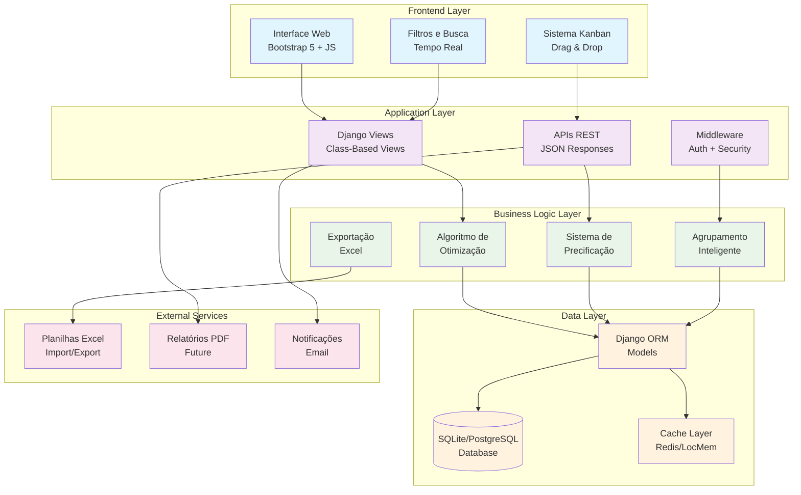
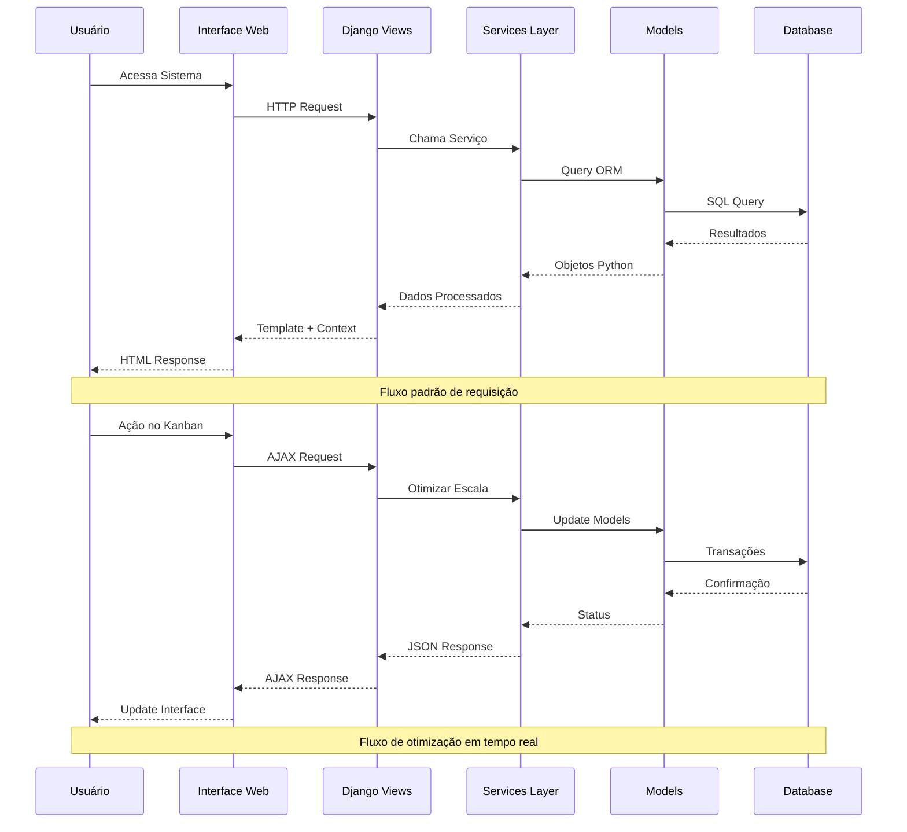
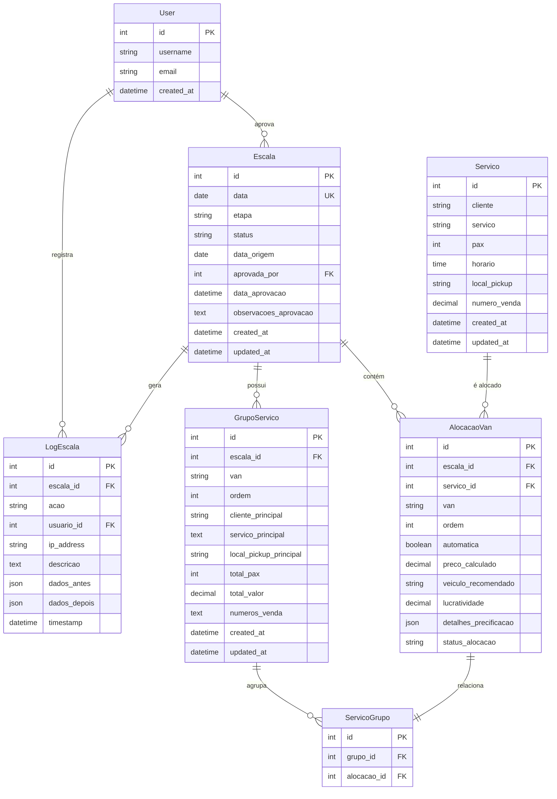
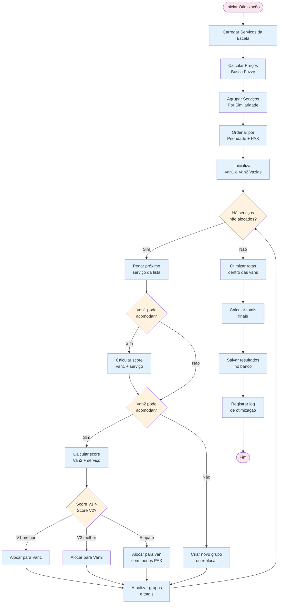
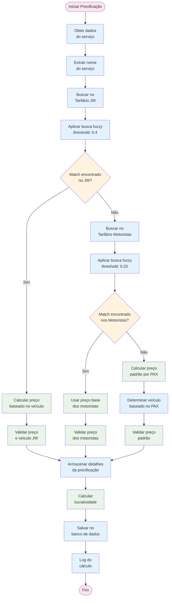
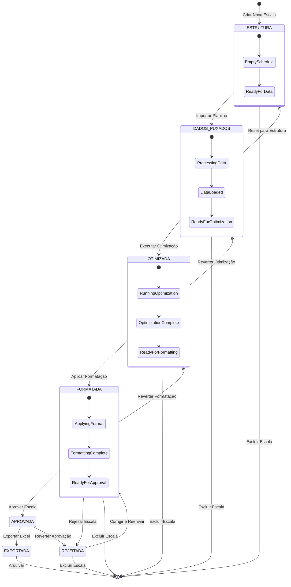
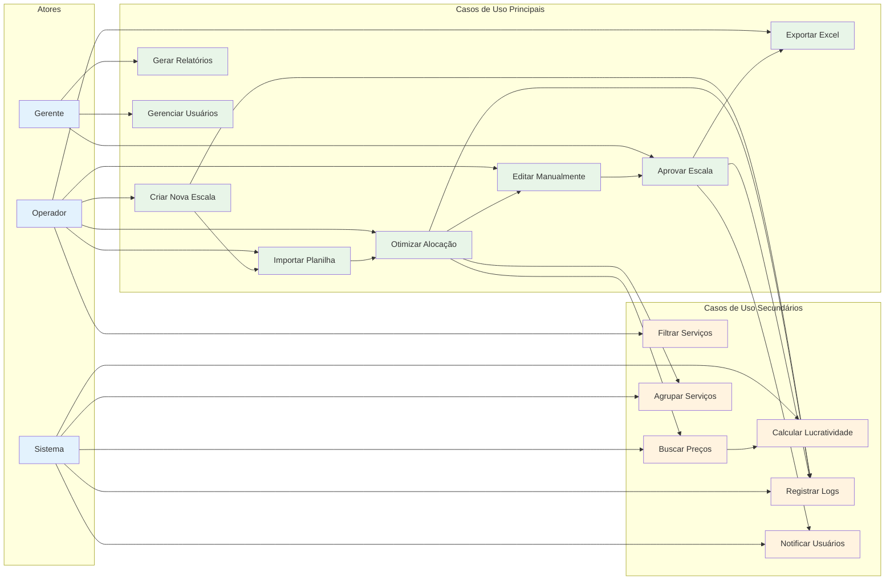
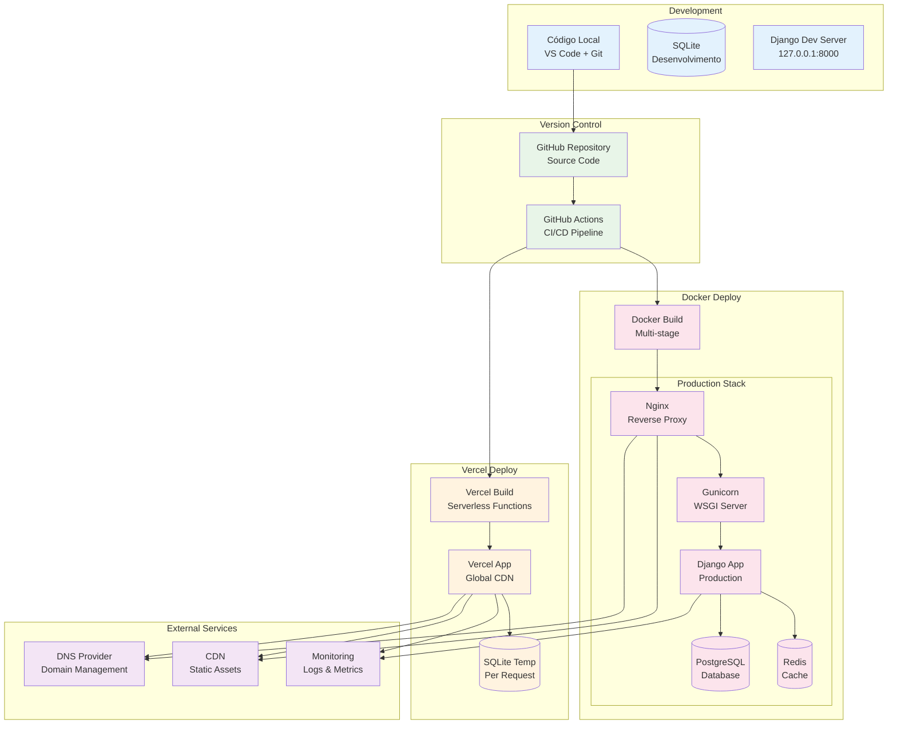
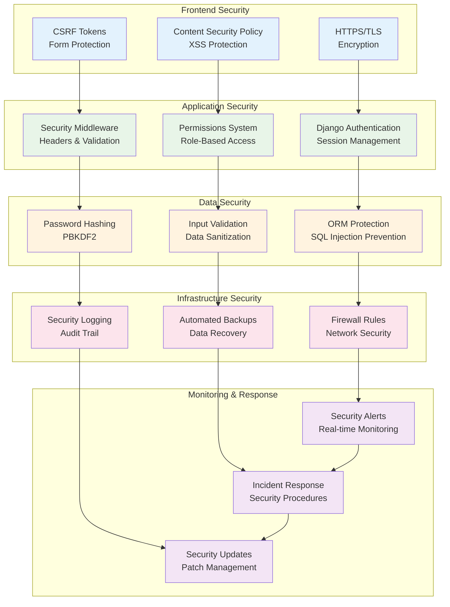
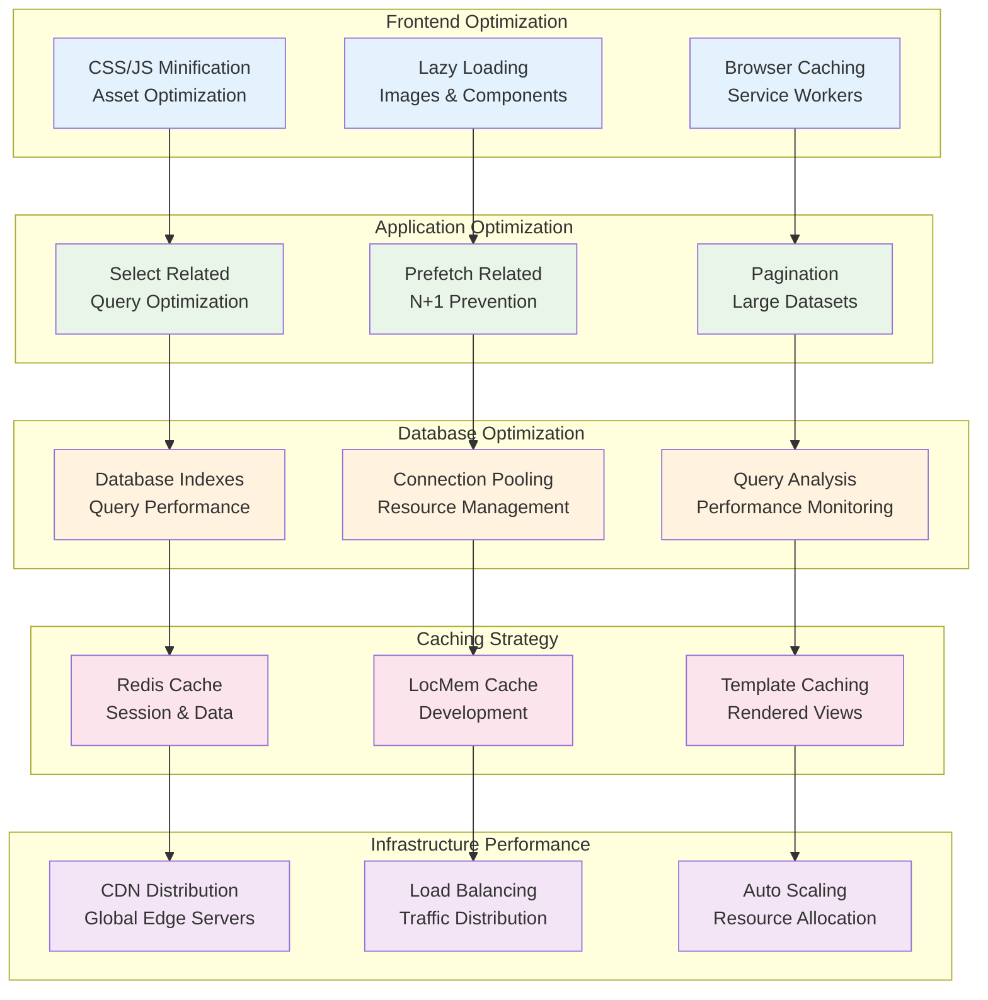

# 🏗️ Arquitetura do Sistema

Este documento descreve a arquitetura completa do Sistema de Fretamento Intertouring.

## 📊 Visão Geral da Arquitetura



## 🔄 Fluxo de Dados Principal



## 🗄️ Modelo de Dados (ERD)



## 🧠 Algoritmo de Otimização



## 💰 Sistema de Precificação



## 🎯 Interface Kanban - Componentes

```mermaid
graph TB
    subgraph "Kanban Board"
        FILTERS[Filtros Avançados<br/>Cliente, PAX, Valor, Status]
        
        subgraph "Van 1 Column"
            V1H[Header Van 1<br/>Total PAX | Total Valor]
            V1G1[Grupo 1<br/>Cliente A | 15 PAX]
            V1G2[Grupo 2<br/>Cliente B | 8 PAX]
            V1G3[Grupo 3<br/>Cliente C | 12 PAX]
        end
        
        subgraph "Van 2 Column"
            V2H[Header Van 2<br/>Total PAX | Total Valor]
            V2G1[Grupo 1<br/>Cliente D | 20 PAX]
            V2G2[Grupo 2<br/>Cliente E | 6 PAX]
        end
        
        subgraph "Não Alocados"
            NAH[Header Não Alocados<br/>Serviços pendentes]
            NA1[Serviço 1<br/>Cliente F | 4 PAX]
            NA2[Serviço 2<br/>Cliente G | 25 PAX]
        end
    end
    
    subgraph "Controls"
        OPT[Botão Otimizar<br/>Automático]
        SAVE[Salvar Alterações<br/>Manual]
        EXPORT[Exportar Excel<br/>Formatado]
        APPROVE[Aprovar Escala<br/>Workflow]
    end
    
    subgraph "Modals"
        EDIT[Modal Edição<br/>Serviço Individual]
        CONFIRM[Modal Confirmação<br/>Ações Críticas]
        DETAIL[Modal Detalhes<br/>Precificação]
    end
    
    FILTERS --> V1H
    FILTERS --> V2H
    FILTERS --> NAH
    
    V1G1 -.->|Drag & Drop| V2G1
    V1G2 -.->|Drag & Drop| NA1
    NA1 -.->|Drag & Drop| V1G3
    
    OPT --> V1G1
    OPT --> V2G1
    SAVE --> V1G1
    EXPORT --> V1G1
    
    V1G1 --> EDIT
    OPT --> CONFIRM
    V1G1 --> DETAIL
    
    classDef column fill:#e3f2fd
    classDef group fill:#e8f5e8
    classDef control fill:#fff3e0
    classDef modal fill:#fce4ec
    
    class V1H,V2H,NAH column
    class V1G1,V1G2,V1G3,V2G1,V2G2,NA1,NA2 group
    class FILTERS,OPT,SAVE,EXPORT,APPROVE control
    class EDIT,CONFIRM,DETAIL modal
```

## 🔄 Estados e Transições da Escala



## 📱 Casos de Uso do Sistema



## 🚀 Arquitetura de Deploy



## 🔒 Arquitetura de Segurança



## 📊 Arquitetura de Performance



---

## 🏛️ Padrões Arquiteturais Utilizados

### 1. **Model-View-Template (MVT)**
- **Models**: Representação dos dados e lógica de negócio
- **Views**: Controladores que processam requisições
- **Templates**: Apresentação e interface do usuário

### 2. **Repository Pattern**
- Abstração da camada de dados através do Django ORM
- Facilita testes e manutenção
- Isolamento da lógica de persistência

### 3. **Service Layer Pattern**
- Lógica de negócio centralizada em classes de serviço
- Reutilização de código entre views
- Facilita testes unitários

### 4. **Observer Pattern**
- Sistema de logs automáticos
- Notificações de mudanças de estado
- Auditoria de ações do usuário

### 5. **Strategy Pattern**
- Algoritmos de precificação intercambiáveis
- Múltiplos tarifários configuráveis
- Flexibilidade na lógica de cálculo

---

## 📈 Métricas de Performance

### Targets de Performance
- **Response Time**: < 200ms para views principais
- **Database Queries**: < 10 queries por view
- **Memory Usage**: < 512MB por processo
- **Cache Hit Rate**: > 80% para dados frequentes

### Monitoramento
- Django Debug Toolbar em desenvolvimento
- Logs estruturados em produção
- Métricas de banco de dados
- Análise de queries N+1

---

Esta arquitetura foi projetada para ser:
- **Escalável**: Suporta crescimento de usuários e dados
- **Manutenível**: Código limpo e bem documentado
- **Performante**: Otimizada para velocidade e eficiência
- **Segura**: Proteções multicamadas implementadas
- **Flexível**: Permite adaptações e extensões futuras