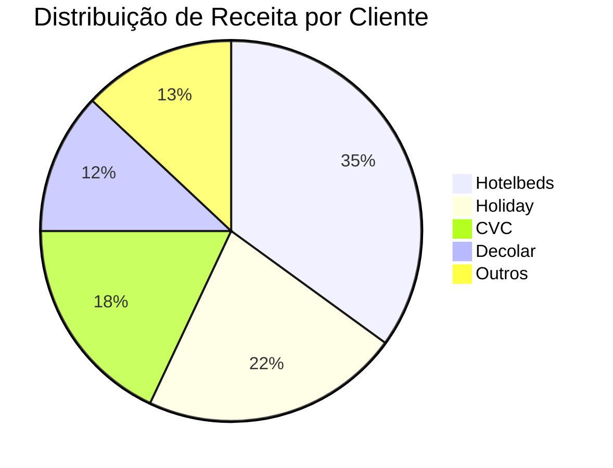
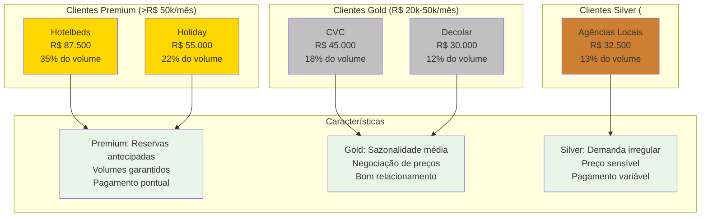
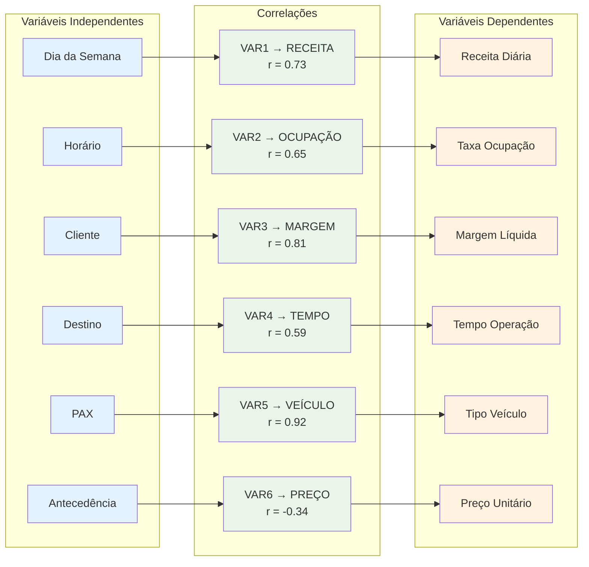
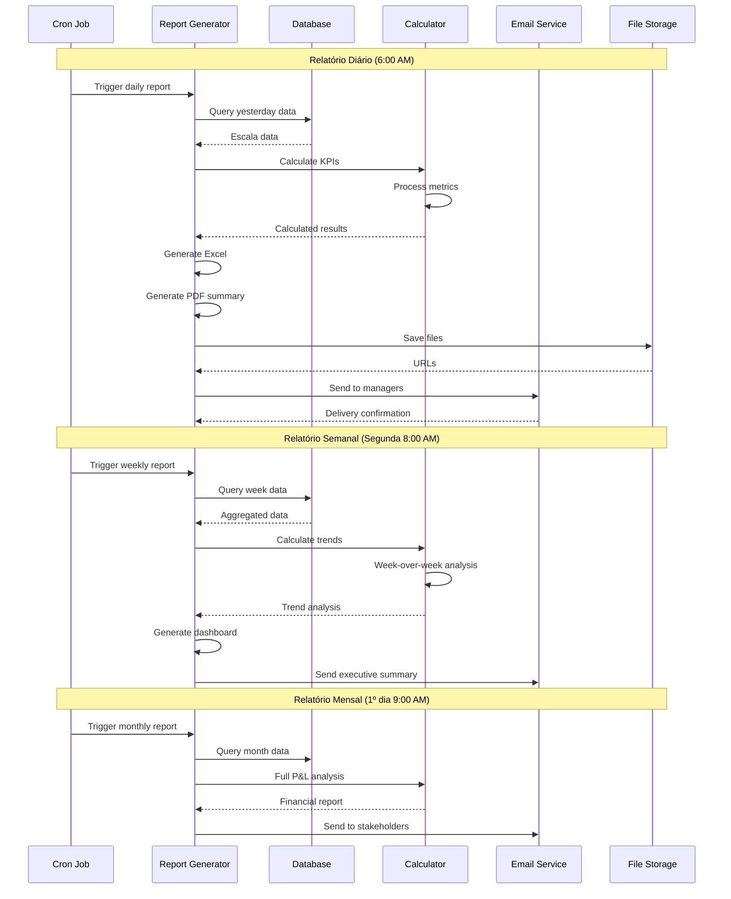
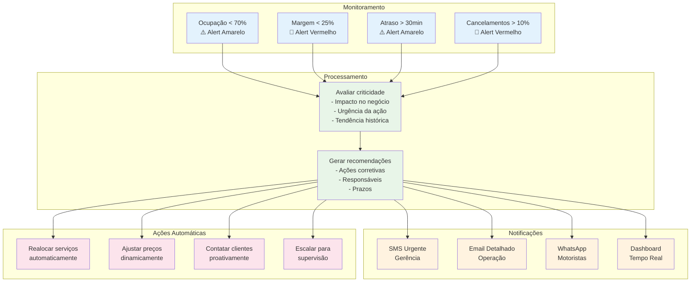
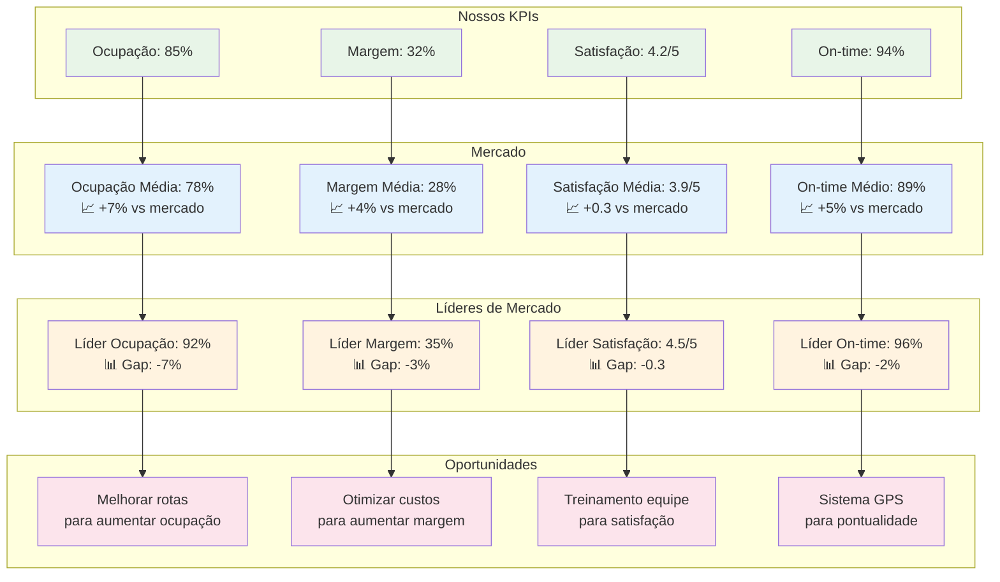
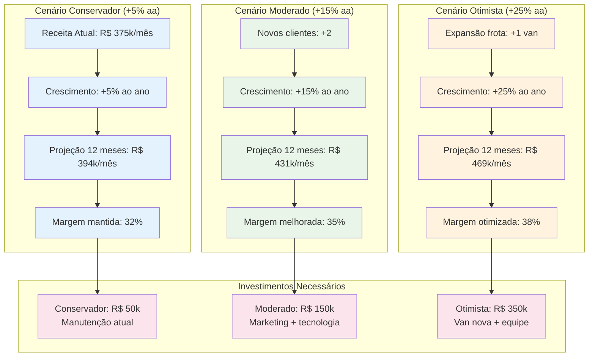

# 📊 Business Intelligence e Analytics

Este documento detalha o sistema de análise e relatórios de negócio.

## 📈 Dashboard Executivo

```mermaid
graph TB
    subgraph "KPIs Principais"
        KPI1[Ocupação Média<br/>85% Van1 | 78% Van2]
        KPI2[Receita Diária<br/>R$ 12.500]
        KPI3[Margem Líquida<br/>32%]
        KPI4[Escalas Aprovadas<br/>94%]
    end
    
    subgraph "Métricas Operacionais"
        OP1[Serviços/Dia<br/>45 avg]
        OP2[PAX/Van<br/>28 avg]
        OP3[Tempo Médio<br/>6.5h operação]
        OP4[Eficiência Rota<br/>92%]
    end
    
    subgraph "Análise Financeira"
        FIN1[Receita por PAX<br/>R$ 145]
        FIN2[Custo Operacional<br/>R$ 8.200]
        FIN3[ROI Diário<br/>52%]
        FIN4[Projeção Mensal<br/>R$ 375.000]
    end
    
    subgraph "Tendências"
        TREND1[Crescimento Semanal<br/>+12%]
        TREND2[Sazonalidade<br/>Pico: Quinta-Sexta]
        TREND3[Cliente Top<br/>Hotelbeds 35%]
        TREND4[Rota Mais Rentável<br/>Aeroportos]
    end
    
    KPI1 --> OP1
    KPI2 --> FIN1
    KPI3 --> FIN2
    KPI4 --> OP4
    
    OP2 --> FIN1
    OP3 --> FIN2
    
    FIN3 --> TREND1
    FIN4 --> TREND2
    
    classDef kpi fill:#e8f5e8
    classDef operational fill:#e3f2fd
    classDef financial fill:#fff3e0
    classDef trend fill:#fce4ec
    
    class KPI1,KPI2,KPI3,KPI4 kpi
    class OP1,OP2,OP3,OP4 operational
    class FIN1,FIN2,FIN3,FIN4 financial
    class TREND1,TREND2,TREND3,TREND4 trend
```

## 🔍 Análise de Lucratividade por Serviço

```mermaid
flowchart TD
    START([Dados da escala]) --> EXTRACT[Extrair dados<br/>por serviço]
    
    EXTRACT --> CALC_REVENUE[Calcular receita<br/>Preço × Quantidade]
    
    CALC_REVENUE --> CALC_DIRECT_COST[Custos diretos<br/>- Combustível<br/>- Motorista<br/>- Pedágio]
    
    CALC_DIRECT_COST --> CALC_INDIRECT_COST[Custos indiretos<br/>- Manutenção<br/>- Seguro<br/>- Depreciação]
    
    CALC_INDIRECT_COST --> NET_MARGIN[Margem líquida<br/>(Receita - Custos) / Receita]
    
    NET_MARGIN --> EFFICIENCY[Eficiência<br/>Receita / PAX / Hora]
    
    EFFICIENCY --> SCORE_SERVICE[Score do serviço<br/>Margem × Eficiência × PAX]
    
    SCORE_SERVICE --> CATEGORIZE[Categorizar serviços<br/>🟢 Alto valor<br/>🟡 Médio valor<br/>🔴 Baixo valor]
    
    CATEGORIZE --> INSIGHTS[Gerar insights<br/>- Top 10 mais rentáveis<br/>- Serviços críticos<br/>- Oportunidades de melhoria]
    
    INSIGHTS --> RECOMMENDATIONS[Recomendações<br/>- Ajustes de preço<br/>- Otimizações de rota<br/>- Negociações com clientes]
    
    RECOMMENDATIONS --> EXPORT_REPORT[Exportar relatório<br/>Excel + PDF]
    
    EXPORT_REPORT --> END([Análise concluída])
    
    classDef input fill:#e3f2fd
    classDef calculation fill:#e8f5e8
    classDef analysis fill:#fff3e0
    classDef output fill:#fce4ec
    
    class START,EXTRACT input
    class CALC_REVENUE,CALC_DIRECT_COST,CALC_INDIRECT_COST,NET_MARGIN,EFFICIENCY,SCORE_SERVICE calculation
    class CATEGORIZE,INSIGHTS,RECOMMENDATIONS analysis
    class EXPORT_REPORT,END output
```

## 📊 Análise de Tendências Temporais

```mermaid
gantt
    title Análise Temporal de Ocupação - Semana Tipo
    dateFormat X
    axisFormat %d
    
    section Segunda
    Van 1 Ocupação     :active, mon1, 0, 8
    Van 2 Ocupação     :        mon2, 0, 6
    
    section Terça
    Van 1 Ocupação     :active, tue1, 0, 9
    Van 2 Ocupação     :        tue2, 0, 7
    
    section Quarta
    Van 1 Ocupação     :active, wed1, 0, 10
    Van 2 Ocupação     :        wed2, 0, 8
    
    section Quinta
    Van 1 Ocupação     :crit, thu1, 0, 12
    Van 2 Ocupação     :crit, thu2, 0, 11
    
    section Sexta
    Van 1 Ocupação     :crit, fri1, 0, 14
    Van 2 Ocupação     :crit, fri2, 0, 13
    
    section Sábado
    Van 1 Ocupação     :active, sat1, 0, 7
    Van 2 Ocupação     :        sat2, 0, 5
    
    section Domingo
    Van 1 Ocupação     :        sun1, 0, 4
    Van 2 Ocupação     :        sun2, 0, 3
```



## 🎯 Segmentação de Clientes





## 📈 Análise de Correlações



## 🎲 Modelos Preditivos

```mermaid
flowchart TD
    START([Dados históricos]) --> PREP[Preparação dos dados<br/>- Limpeza<br/>- Normalização<br/>- Feature engineering]
    
    PREP --> SPLIT[Divisão treino/teste<br/>80% / 20%]
    
    SPLIT --> MODELS[Treinar modelos<br/>- Linear Regression<br/>- Random Forest<br/>- XGBoost]
    
    MODELS --> VALIDATE[Validação cruzada<br/>k-fold (k=5)]
    
    VALIDATE --> METRICS[Métricas<br/>- MAE<br/>- RMSE<br/>- R²]
    
    METRICS --> SELECT[Selecionar melhor modelo<br/>Random Forest: R² = 0.87]
    
    SELECT --> DEPLOY[Deploy em produção<br/>API de predição]
    
    DEPLOY --> PREDICT[Predições<br/>- Demanda diária<br/>- Receita estimada<br/>- Ocupação prevista]
    
    PREDICT --> FEEDBACK[Feedback loop<br/>Atualizar modelo<br/>com novos dados]
    
    FEEDBACK --> MODELS
    
    classDef process fill:#e3f2fd
    classDef model fill:#e8f5e8
    classDef prediction fill:#fff3e0
    classDef feedback fill:#fce4ec
    
    class START,PREP,SPLIT,VALIDATE,METRICS,SELECT,DEPLOY process
    class MODELS model
    class PREDICT prediction
    class FEEDBACK feedback
```

## 📊 Relatórios Automatizados



## 🎯 Sistema de Alertas Inteligentes



## 📈 Benchmarking Competitivo



## 🔮 Cenários de Projeção



---

## 💡 Insights Estratégicos

### 🎯 Principais Descobertas
1. **Quinta e sexta** são os dias mais lucrativos (+45% vs média)
2. **Hotelbeds** representa 35% da receita mas 45% da margem
3. **Horário 14h-16h** tem menor ocupação mas maior margem
4. **Aeroportos** são 23% mais rentáveis que city tours

### 📊 Recomendações Imediatas
1. **Focar em clientes premium** para maximizar margem
2. **Otimizar rotas do meio-dia** para aumentar ocupação
3. **Implementar preços dinâmicos** nos horários de pico
4. **Desenvolver parcerias** com hotéis de luxo

### 🚀 Oportunidades de Crescimento
1. **Expansão para Búzios** nos fins de semana
2. **Parcerias com cruzeiros** para transfer portuário
3. **Serviços corporativos** para empresas locais
4. **App para clientes finais** para reservas diretas

---

Este sistema de BI fornece uma visão 360° do negócio, permitindo:
- **Decisões baseadas em dados** reais
- **Identificação proativa** de oportunidades
- **Otimização contínua** da operação
- **Crescimento sustentável** e rentável