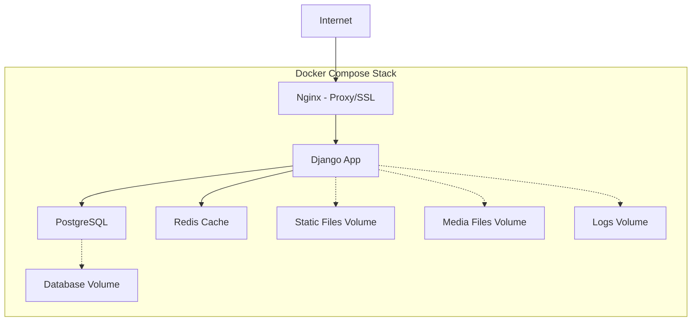

# Deploy com Docker

Este guia detalha como fazer deploy do Fretamento Intertouring usando Docker e Docker Compose para um ambiente de produção robusto e escalável.

## 🐳 Visão Geral da Arquitetura Docker



### Componentes do Stack

| Serviço | Imagem | Porta | Função |
|---------|--------|-------|---------|
| **nginx** | nginx:alpine | 80, 443 | Proxy reverso, SSL, arquivos estáticos |
| **web** | Custom Django | 8000 | Aplicação Django |
| **db** | postgres:15 | 5432 | Banco de dados |
| **redis** | redis:7-alpine | 6379 | Cache e sessões |

## 🚀 Deploy Automatizado

### Script de Deploy (Recomendado)

O método mais simples é usar o script automatizado:

```bash
# 1. Clone o repositório
git clone <repository-url>
cd fretamento-intertouring

# 2. Execute o deploy
./deploy.sh
```

O script `deploy.sh` automaticamente:
- ✅ Instala Docker e Docker Compose
- ✅ Configura certificados SSL
- ✅ Cria diretórios necessários
- ✅ Executa migrações
- ✅ Cria superusuário
- ✅ Configura backups automáticos
- ✅ Inicia todos os serviços

### Acompanhamento do Deploy

```bash
# Seguir logs durante deploy
docker-compose logs -f

# Verificar status dos serviços
docker-compose ps

# Testar aplicação
curl http://localhost/health/
```

## ⚙️ Deploy Manual Passo-a-Passo

### 1. Preparação do Ambiente

#### Instalar Docker
```bash
# Ubuntu/Debian
curl -fsSL https://get.docker.com -o get-docker.sh
sudo sh get-docker.sh
sudo usermod -aG docker $USER

# Logout/login para aplicar permissões
```

#### Instalar Docker Compose
```bash
sudo curl -L "https://github.com/docker/compose/releases/download/v2.23.0/docker-compose-$(uname -s)-$(uname -m)" -o /usr/local/bin/docker-compose
sudo chmod +x /usr/local/bin/docker-compose
```

### 2. Configuração de Ambiente

#### Criar arquivo .env
```bash
cp .env.example .env
```

#### Configurar variáveis essenciais
```bash
# .env
DJANGO_SECRET_KEY=your-super-secret-key-here
DB_PASSWORD=your-strong-database-password
DEBUG=False
ALLOWED_HOSTS=your-domain.com,www.your-domain.com
```

!!! warning "Segurança"
    Sempre use senhas fortes e chaves secretas únicas em produção!

### 3. Configuração SSL

#### Certificados Auto-assinados (Desenvolvimento)
```bash
mkdir -p nginx/ssl
openssl req -x509 -newkey rsa:4096 -keyout nginx/ssl/key.pem -out nginx/ssl/cert.pem -days 365 -nodes
```

#### Certificados Let's Encrypt (Produção)
```bash
# Instalar certbot
sudo apt install certbot

# Gerar certificados
sudo certbot certonly --standalone -d your-domain.com -d www.your-domain.com

# Copiar certificados
sudo cp /etc/letsencrypt/live/your-domain.com/fullchain.pem nginx/ssl/cert.pem
sudo cp /etc/letsencrypt/live/your-domain.com/privkey.pem nginx/ssl/key.pem
```

### 4. Build e Deploy

#### Build das imagens
```bash
docker-compose build
```

#### Iniciar serviços base
```bash
docker-compose up -d db redis
```

#### Aguardar inicialização
```bash
# Aguardar banco de dados
docker-compose exec db pg_isready -U fretamento_user
```

#### Executar migrações
```bash
docker-compose run --rm web python manage.py migrate --settings=fretamento_project.settings_production
```

#### Coletar arquivos estáticos
```bash
docker-compose run --rm web python manage.py collectstatic --noinput --settings=fretamento_project.settings_production
```

#### Criar superusuário
```bash
docker-compose run --rm web python manage.py createsuperuser --settings=fretamento_project.settings_production
```

#### Iniciar todos os serviços
```bash
docker-compose up -d
```

## 📊 Verificação de Deploy

### Health Checks

```bash
# Verificar saúde geral
curl http://localhost/health/

# Verificar métricas
curl http://localhost/metrics/

# Testar HTTPS
curl -k https://localhost/health/
```

### Status dos Containers

```bash
# Listar containers
docker-compose ps

# Logs de um serviço específico
docker-compose logs web

# Logs em tempo real
docker-compose logs -f
```

### Teste de Funcionalidades

1. **Login**: Acesse `/admin/` e faça login
2. **Upload**: Teste upload de planilha
3. **Escala**: Crie uma escala teste
4. **Performance**: Verifique tempos de resposta

## 🔧 Configurações de Produção

### docker-compose.yml Otimizado

```yaml
version: '3.8'

services:
  db:
    image: postgres:15
    restart: unless-stopped
    environment:
      POSTGRES_DB: fretamento_prod
      POSTGRES_USER: fretamento_user
      POSTGRES_PASSWORD: ${DB_PASSWORD}
    volumes:
      - postgres_data:/var/lib/postgresql/data
    deploy:
      resources:
        limits:
          memory: 1G
        reservations:
          memory: 512M

  redis:
    image: redis:7-alpine
    restart: unless-stopped
    command: redis-server --maxmemory 256mb --maxmemory-policy allkeys-lru
    volumes:
      - redis_data:/data

  web:
    build: .
    restart: unless-stopped
    depends_on:
      - db
      - redis
    environment:
      - DJANGO_ENV=production
    volumes:
      - static_volume:/app/staticfiles
      - media_volume:/app/media
      - ./logs:/app/logs
    deploy:
      replicas: 2
      resources:
        limits:
          memory: 1G
        reservations:
          memory: 512M

  nginx:
    image: nginx:alpine
    restart: unless-stopped
    ports:
      - "80:80"
      - "443:443"
    volumes:
      - ./nginx/nginx.conf:/etc/nginx/nginx.conf
      - ./nginx/ssl:/etc/nginx/ssl
      - static_volume:/var/www/static
      - media_volume:/var/www/media
    depends_on:
      - web
```

### Nginx Otimizado para Produção

```nginx
# nginx/nginx.conf
worker_processes auto;
worker_connections 1024;

http {
    # Gzip compression
    gzip on;
    gzip_vary on;
    gzip_min_length 1000;
    gzip_comp_level 6;
    
    # Rate limiting
    limit_req_zone $binary_remote_addr zone=api:10m rate=100r/m;
    limit_req_zone $binary_remote_addr zone=login:10m rate=5r/m;
    
    # Security headers
    add_header X-Frame-Options DENY always;
    add_header X-Content-Type-Options nosniff always;
    add_header X-XSS-Protection "1; mode=block" always;
    
    # SSL optimization
    ssl_protocols TLSv1.2 TLSv1.3;
    ssl_ciphers ECDHE-RSA-AES128-GCM-SHA256:ECDHE-RSA-AES256-GCM-SHA384;
    ssl_session_cache shared:SSL:10m;
    
    upstream django {
        server web:8000;
        # Para múltiplas instâncias:
        # server web1:8000;
        # server web2:8000;
    }
    
    server {
        listen 443 ssl http2;
        server_name your-domain.com;
        
        ssl_certificate /etc/nginx/ssl/cert.pem;
        ssl_certificate_key /etc/nginx/ssl/key.pem;
        
        location /static/ {
            alias /var/www/static/;
            expires 1y;
            add_header Cache-Control "public, immutable";
        }
        
        location / {
            proxy_pass http://django;
            proxy_set_header Host $host;
            proxy_set_header X-Real-IP $remote_addr;
            proxy_set_header X-Forwarded-For $proxy_add_x_forwarded_for;
            proxy_set_header X-Forwarded-Proto $scheme;
        }
    }
}
```

## 📈 Escalabilidade

### Escala Horizontal

#### Múltiplas Instâncias Django
```yaml
web:
  deploy:
    replicas: 3  # Múltiplas instâncias
  environment:
    - DJANGO_ENV=production
```

#### Load Balancer Nginx
```nginx
upstream django {
    server web1:8000;
    server web2:8000;
    server web3:8000;
}
```

### Escala Vertical

#### Recursos por Container
```yaml
deploy:
  resources:
    limits:
      cpus: '2.0'
      memory: 2G
    reservations:
      cpus: '1.0'
      memory: 1G
```

## 💾 Backup e Recuperação

### Backup Automático

O script `backup.sh` é criado automaticamente:

```bash
#!/bin/bash
# Backup do banco de dados
docker-compose exec -T db pg_dump -U fretamento_user fretamento_prod > "backups/backup_$(date +%Y%m%d_%H%M%S).sql"

# Backup de arquivos
tar -czf "backups/files_$(date +%Y%m%d_%H%M%S).tar.gz" media/ logs/
```

### Crontab para Backups
```bash
# Backup diário às 2h da manhã
0 2 * * * cd /path/to/project && ./backup.sh

# Limpeza semanal de backups antigos
0 3 * * 0 find /path/to/project/backups -name "*.sql" -mtime +7 -delete
```

### Recuperação de Backup
```bash
# Restaurar banco de dados
docker-compose exec -T db psql -U fretamento_user fretamento_prod < backup_20241007_140000.sql

# Restaurar arquivos
tar -xzf files_20241007_140000.tar.gz
```

## 🔍 Monitoramento

### Logs Centralizados
```bash
# Ver todos os logs
docker-compose logs -f

# Logs de um serviço específico
docker-compose logs -f web

# Logs com timestamp
docker-compose logs -f -t
```

### Métricas de Sistema
```bash
# Uso de recursos
docker stats

# Espaço em disco
docker system df

# Limpeza de recursos não utilizados
docker system prune -a
```

### Health Checks Avançados
```bash
# Script de monitoramento
#!/bin/bash
while true; do
    if curl -f http://localhost/health/ > /dev/null 2>&1; then
        echo "$(date): Sistema OK"
    else
        echo "$(date): Sistema com problemas!"
        # Enviar notificação
    fi
    sleep 60
done
```

## 🚨 Troubleshooting

### Problemas Comuns

#### Container não inicia
```bash
# Verificar logs
docker-compose logs container-name

# Verificar configuração
docker-compose config

# Rebuild se necessário
docker-compose build --no-cache
```

#### Problema de conectividade
```bash
# Verificar rede
docker network ls
docker network inspect fretamento-intertouring_default

# Testar conectividade entre containers
docker-compose exec web ping db
```

#### Performance ruim
```bash
# Verificar recursos
docker stats

# Verificar logs de erro
docker-compose logs web | grep ERROR

# Verificar banco de dados
docker-compose exec db psql -U fretamento_user -c "\l"
```

### Comandos de Diagnóstico

```bash
# Status completo
docker-compose ps
docker-compose top

# Inspeção detalhada
docker-compose exec web python manage.py check --deploy

# Teste de conectividade
docker-compose exec web python manage.py dbshell
```

## 🔄 Atualizações

### Script de Atualização

O script `update.sh` automatiza atualizações:

```bash
#!/bin/bash
echo "Atualizando aplicação..."

# Backup antes da atualização
./backup.sh

# Atualizar código
git pull

# Rebuild containers
docker-compose build

# Aplicar migrações
docker-compose run --rm web python manage.py migrate --settings=fretamento_project.settings_production

# Coletar estáticos
docker-compose run --rm web python manage.py collectstatic --noinput --settings=fretamento_project.settings_production

# Restart serviços
docker-compose up -d

echo "Atualização concluída!"
```

### Atualizações sem Downtime

```bash
# Rolling update (para múltiplas instâncias)
docker-compose up -d --scale web=0
docker-compose build web
docker-compose up -d --scale web=2
```

---

## ✅ Checklist de Deploy

- [ ] Docker e Docker Compose instalados
- [ ] Arquivo `.env` configurado
- [ ] Certificados SSL configurados
- [ ] Firewall configurado (portas 80, 443)
- [ ] DNS apontando para o servidor
- [ ] Backup inicial criado
- [ ] Health checks funcionando
- [ ] Monitoramento configurado
- [ ] Scripts de manutenção testados
- [ ] Documentação atualizada
- [ ] Equipe treinada

---

*🚀 **Sucesso!** Seu deploy Docker está completo e pronto para produção!*