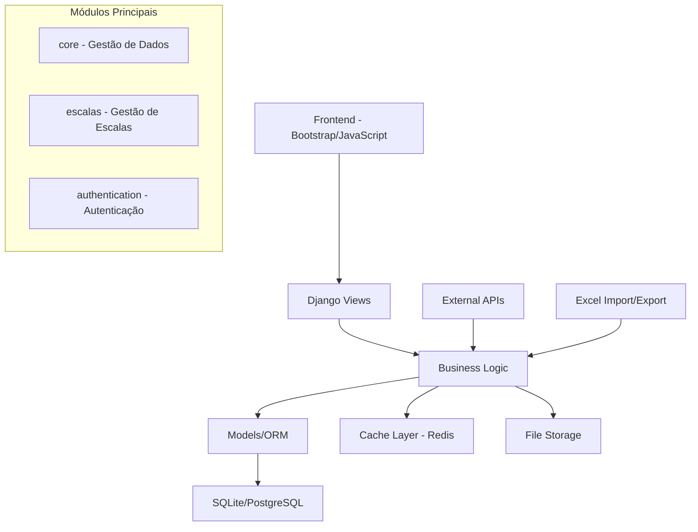

# Fretamento Intertouring

Sistema completo de gestão de escalas e fretamento para a empresa Intertouring.

## 🚀 Visão Geral

O **Fretamento Intertouring** é uma aplicação web Django desenvolvida para gerenciar eficientemente escalas de transporte, otimização de rotas, cálculo de preços e coordenação de veículos para serviços de fretamento.

### ✨ Principais Funcionalidades

- **📊 Gestão de Escalas**: Interface Kanban intuitiva para organizar e visualizar escalas diárias
- **📈 Otimização Inteligente**: Algoritmos avançados para alocação otimizada de serviços em veículos
- **💰 Cálculo de Preços**: Sistema inteligente de busca e cálculo de tarifas com múltiplos tarifários
- **📋 Upload de Planilhas**: Importação automática de dados via planilhas Excel
- **🔄 Agrupamento Automático**: Agrupamento inteligente de serviços similares
- **📊 Relatórios**: Exportação de escalas formatadas para Excel
- **🔐 Segurança**: Sistema robusto de autenticação e controle de acesso

### 🏗️ Arquitetura



### 🛠️ Stack Tecnológica

- **Backend**: Django 4.2+ (Python)
- **Frontend**: Bootstrap 5, JavaScript, jQuery
- **Banco de Dados**: SQLite (dev) / PostgreSQL (prod)
- **Cache**: Redis
- **Documentação**: MkDocs Material
- **Deploy**: Docker, Docker Compose, Nginx

## 📚 Documentação

### Para Usuários
- [**Introdução**](user-guide/introducao.md) - Como começar a usar o sistema
- [**Login e Acesso**](user-guide/login.md) - Guia de acesso e autenticação
- [**Gestão de Escalas**](user-guide/escalas.md) - Como gerenciar escalas diárias
- [**Upload de Planilhas**](user-guide/upload.md) - Importação de dados
- [**Tarifários**](user-guide/tarifarios.md) - Sistema de preços
- [**Relatórios**](user-guide/relatorios.md) - Exportação e relatórios

### Para Desenvolvedores
- [**Arquitetura**](technical/arquitetura.md) - Estrutura técnica do sistema
- [**Modelos de Dados**](technical/modelos.md) - Schema do banco de dados
- [**APIs**](technical/apis.md) - Documentação das APIs
- [**Performance**](technical/performance.md) - Otimizações implementadas
- [**Segurança**](technical/seguranca.md) - Medidas de segurança

### Para Deploy
- [**Requisitos**](deploy/requisitos.md) - Requisitos de sistema
- [**Configuração**](deploy/configuracao.md) - Configuração de ambiente
- [**Docker**](deploy/docker.md) - Deploy com containers
- [**Produção**](deploy/producao.md) - Deploy em produção
- [**Monitoramento**](deploy/monitoramento.md) - Health checks e métricas

## 🚀 Quick Start

### 1. Clone e Configure

```bash
git clone <repository-url>
cd fretamento-intertouring
cp .env.example .env
# Configure suas variáveis de ambiente
```

### 2. Deploy com Docker

```bash
# Deploy completo com um comando
./deploy.sh
```

### 3. Acesse o Sistema

- **Aplicação**: http://localhost
- **Admin**: http://localhost/admin/
- **Health Check**: http://localhost/health/
- **Documentação**: http://localhost:8001 (via mkdocs serve)

## 📈 Status do Projeto

### ✅ Implementado
- [x] Sistema de escalas com Kanban
- [x] Upload e processamento de planilhas
- [x] Cálculo inteligente de preços
- [x] Agrupamento automático de serviços
- [x] Otimização de queries (performance)
- [x] Sistema de segurança robusto
- [x] Deploy automatizado com Docker
- [x] Health checks e monitoramento
- [x] Documentação completa

### 🔧 Melhorias Contínuas
- [ ] Testes automatizados
- [ ] CI/CD pipeline
- [ ] Backup automatizado
- [ ] Notificações em tempo real
- [ ] Dashboard de analytics

## 🤝 Contribuição

1. Fork o projeto
2. Crie sua feature branch (`git checkout -b feature/AmazingFeature`)
3. Commit suas mudanças (`git commit -m 'Add some AmazingFeature'`)
4. Push para a branch (`git push origin feature/AmazingFeature`)
5. Abra um Pull Request

## 📝 Licença

Este projeto é propriedade da **Intertouring** e destinado ao uso interno da empresa.

## 📞 Suporte

Para suporte técnico ou dúvidas sobre o sistema:

- **Email**: suporte@intertouring.com.br
- **Telefone**: (11) 1234-5678
- **Documentação**: Esta documentação completa
- **Issues**: Use o sistema de issues do repositório

---

*Desenvolvido com ❤️ para otimizar as operações de fretamento da Intertouring*
