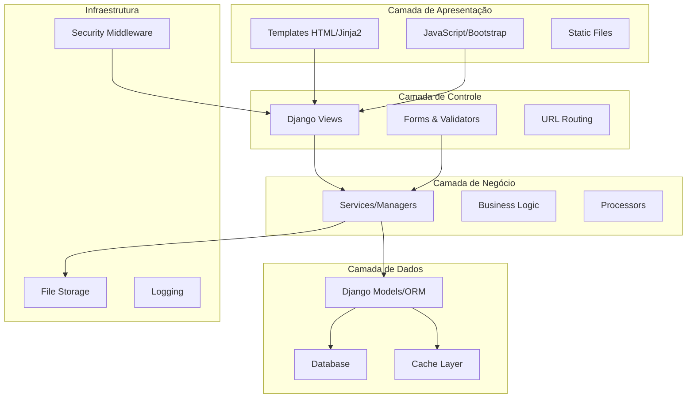
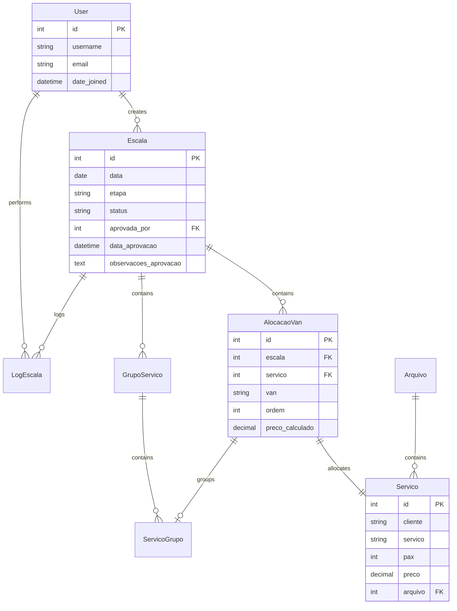
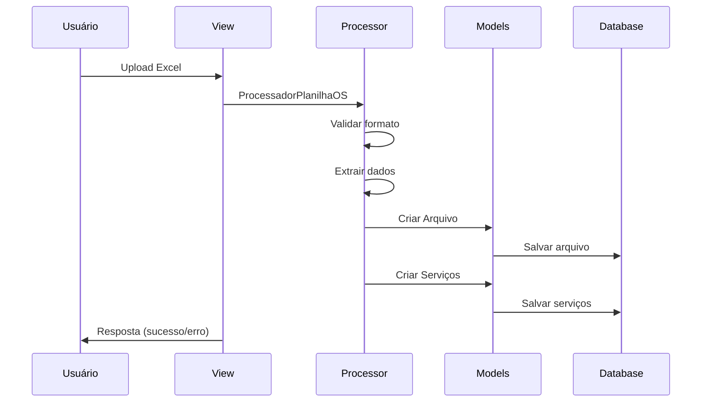
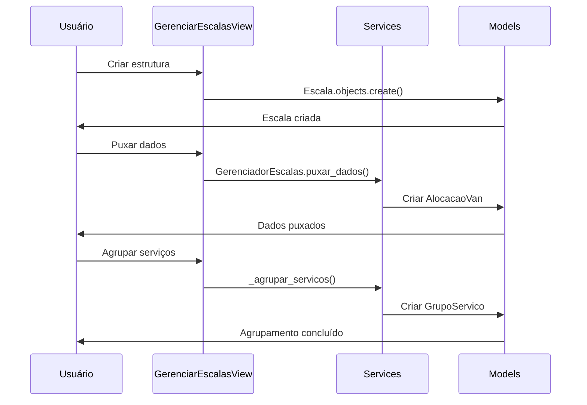
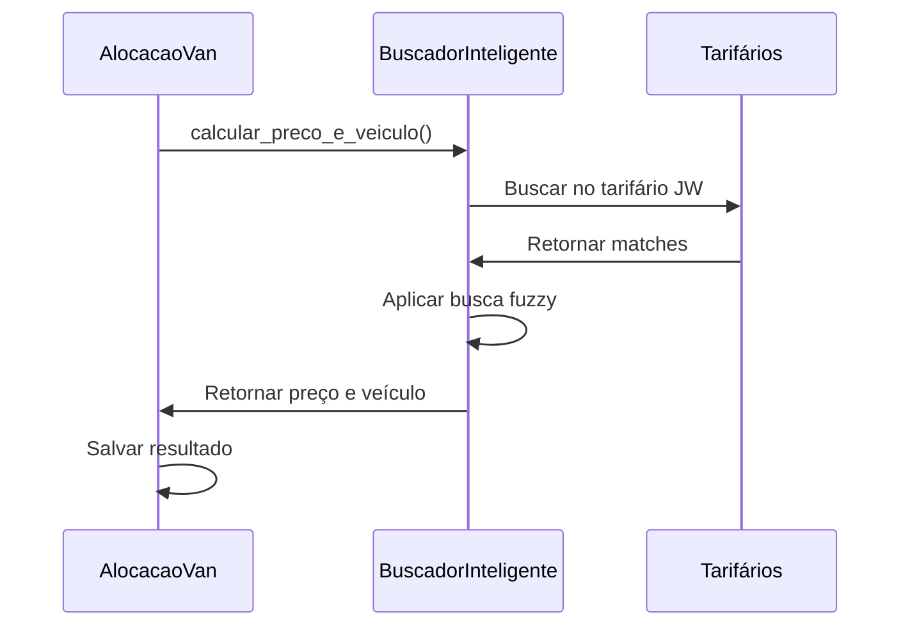
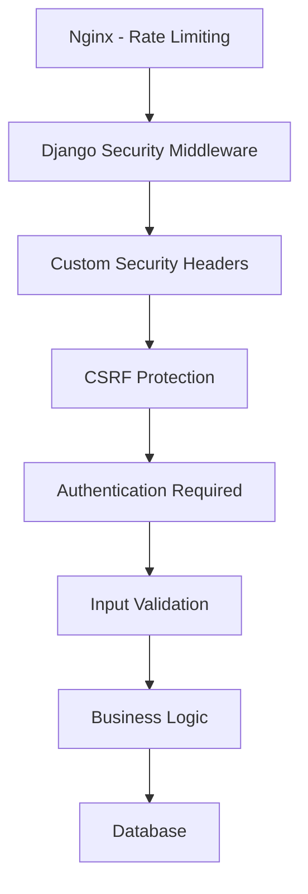

# Arquitetura do Sistema

## 🏗️ Visão Geral da Arquitetura

O Fretamento Intertouring foi desenvolvido seguindo os princípios de arquitetura em camadas (layered architecture) e padrões de design do Django Framework.



## 📱 Estrutura de Aplicações Django

### Core App (`core/`)
**Responsabilidade**: Funcionalidades centrais e gestão de dados

```
core/
├── models.py              # Modelos base (Servico, Arquivo, etc.)
├── views.py               # Views principais (upload, home, etc.)
├── processors.py          # Processamento de planilhas
├── busca_inteligente_precos.py # Sistema de cálculo de preços
├── tarifarios.py          # Gestão de tarifários
├── middleware.py          # Middleware customizado de segurança
├── security_validators.py # Validadores de entrada
└── health_views.py        # Health checks e métricas
```

### Escalas App (`escalas/`)
**Responsabilidade**: Gestão de escalas e otimização

```
escalas/
├── models.py     # Escala, AlocacaoVan, GrupoServico
├── views.py      # Interface Kanban, otimização
├── services.py   # Lógica de agrupamento e otimização
└── urls.py       # Rotas das escalas
```

### Authentication App (`authentication/`)
**Responsabilidade**: Autenticação e controle de acesso

```
authentication/
├── views.py      # Login, logout, perfil
└── urls.py       # Rotas de autenticação
```

## 🗄️ Arquitetura de Dados

### Modelo Conceitual



### Índices de Performance

Todos os modelos principais possuem índices estratégicos para otimização:

- **Escala**: `data`, `etapa`, `status`, `created_at`
- **AlocacaoVan**: `escala`, `van`, `ordem`, `status_alocacao`
- **GrupoServico**: `escala`, `van`, `ordem`, `created_at`
- **LogEscala**: `escala`, `acao`, `usuario`, `timestamp`

## 🔄 Fluxo de Dados

### 1. Upload de Planilha


### 2. Criação de Escala


### 3. Cálculo de Preços


## 🚀 Componentes de Performance

### 1. Cache Strategy
```python
# Cache de sessão
SESSION_ENGINE = 'django.contrib.sessions.backends.cached_db'

# Cache de queries
CACHES = {
    'default': {
        'BACKEND': 'django_redis.cache.RedisCache',
        'LOCATION': 'redis://127.0.0.1:6379/1',
        'TIMEOUT': 300,
    }
}
```

### 2. Query Optimization
```python
# Uso extensivo de select_related e prefetch_related
escalas = Escala.objects.select_related(
    'aprovada_por'
).prefetch_related(
    'alocacoes__servico',
    'grupos__servicos__alocacao__servico'
).annotate(
    total_servicos=Count('alocacoes'),
    total_valor=Sum('alocacoes__preco_calculado')
)
```

### 3. Database Indexes
```python
class Meta:
    indexes = [
        models.Index(fields=['data']),
        models.Index(fields=['etapa']),
        models.Index(fields=['data', 'etapa']),
    ]
```

## 🔒 Arquitetura de Segurança

### 1. Camadas de Segurança


### 2. Middleware Stack
```python
MIDDLEWARE = [
    'django.middleware.security.SecurityMiddleware',
    'core.middleware.SecurityHeadersMiddleware',
    'core.middleware.RateLimitMiddleware',
    'django.contrib.sessions.middleware.SessionMiddleware',
    'django.middleware.csrf.CsrfViewMiddleware',
    'core.middleware.SessionTimeoutMiddleware',
    'core.middleware.AuditLogMiddleware',
    'django.contrib.auth.middleware.AuthenticationMiddleware',
]
```

## 📊 Monitoramento e Observabilidade

### Health Checks
- **`/health/`**: Verificação completa do sistema
- **`/metrics/`**: Métricas de performance

### Logging Strategy
```python
LOGGING = {
    'loggers': {
        'django': {'level': 'INFO'},
        'core': {'level': 'DEBUG'},
        'escalas': {'level': 'DEBUG'},
    },
    'handlers': {
        'file': {'class': 'logging.handlers.RotatingFileHandler'},
        'console': {'class': 'logging.StreamHandler'},
    }
}
```

## 🔧 Padrões Arquiteturais

### 1. Service Layer Pattern
```python
class GerenciadorEscalas:
    """Service layer para operações complexas de escalas"""
    
    def puxar_dados(self, escala):
        # Lógica complexa encapsulada
        pass
    
    def agrupar_servicos(self, escala):
        # Algoritmo de agrupamento
        pass
```

### 2. Repository Pattern (via Django ORM)
```python
# Managers customizados para encapsular queries
class EscalaManager(models.Manager):
    def do_mes(self, ano, mes):
        return self.filter(data__year=ano, data__month=mes)
```

### 3. Strategy Pattern (Processadores)
```python
class ProcessadorPlanilhaOS:
    """Strategy para processar planilhas de OS"""
    
    def processar(self, arquivo):
        # Implementação específica
        pass
```

## 🚀 Escalabilidade

### Horizontal Scaling
- **Load Balancer**: Nginx
- **App Servers**: Múltiplas instâncias Django via Docker
- **Database**: PostgreSQL com conexões pooled
- **Cache**: Redis cluster

### Vertical Scaling
- **Query Optimization**: Índices, select_related, prefetch_related
- **Caching**: Redis para sessões e queries
- **Static Files**: Nginx + WhiteNoise
- **Connection Pooling**: Database connections reutilizadas

---

Esta arquitetura garante:
- ✅ **Performance**: Queries otimizadas e cache strategy
- ✅ **Segurança**: Múltiplas camadas de proteção
- ✅ **Manutenibilidade**: Código organizado em camadas
- ✅ **Escalabilidade**: Preparado para crescimento
- ✅ **Observabilidade**: Logs e métricas completas