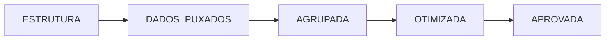
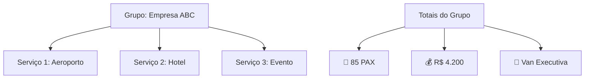

# Gestão de Escalas

A gestão de escalas é o coração do sistema Fretamento Intertouring. Aqui você aprenderá a criar, organizar e otimizar escalas diárias de forma eficiente.

## 🗓️ Conceitos Básicos

### O que é uma Escala?
Uma **escala** representa a organização dos serviços de fretamento para um dia específico, distribuídos entre as vans disponíveis.

### Etapas de uma Escala


- **ESTRUTURA**: Escala criada mas vazia
- **DADOS_PUXADOS**: Serviços carregados do sistema
- **AGRUPADA**: Serviços agrupados por similaridade
- **OTIMIZADA**: Alocação otimizada entre vans
- **APROVADA**: Escala finalizada e aprovada

## 🏗️ Criando uma Nova Escala

### Passo 1: Criar Estrutura
1. Acesse **Escalas → Gerenciar Escalas**
2. Selecione o mês desejado
3. Clique em **"Criar Estrutura"**
4. Informe a data no formato DD/MM/AAAA
5. Clique em **"Criar"**

!!! tip "Dica"
    Crie sempre a estrutura primeiro, mesmo que ainda não tenha os dados dos serviços.

### Passo 2: Puxar Dados
1. Na escala criada, clique em **"Puxar Dados"**
2. O sistema buscará automaticamente:
   - Serviços da data correspondente
   - Preços calculados
   - Veículos recomendados

### Passo 3: Agrupar Serviços
1. Clique em **"Agrupar"**
2. O algoritmo agrupará serviços similares:
   - Mesmo cliente
   - Mesmo tipo de serviço
   - Mesma região/local

## 📊 Interface Kanban

A visualização principal das escalas usa um sistema Kanban intuitivo:

### Layout das Colunas

```
┌─────────────┬─────────────┬─────────────┐
│    VAN 1    │    VAN 2    │ NÃO ALOCADO │
├─────────────┼─────────────┼─────────────┤
│ [Serviço A] │ [Serviço D] │ [Serviço G] │
│ [Serviço B] │ [Serviço E] │ [Serviço H] │
│ [Serviço C] │ [Serviço F] │             │
├─────────────┼─────────────┼─────────────┤
│ 👥 45 PAX   │ 👥 38 PAX   │ 👥 12 PAX   │
│ 💰 R$ 2.500 │ 💰 R$ 2.100 │ 💰 R$ 800   │
└─────────────┴─────────────┴─────────────┘
```

### Cards de Serviço

Cada serviço é representado por um card contendo:

- **🏢 Cliente**: Nome da empresa/pessoa
- **📍 Serviço**: Descrição e destino
- **👥 PAX**: Número de passageiros
- **💰 Valor**: Preço calculado
- **🚐 Veículo**: Tipo recomendado
- **📞 Contato**: Informações de contato

### Cores e Status

| Cor | Status | Significado |
|-----|--------|-------------|
| 🟢 Verde | ALOCADO | Serviço alocado em uma van |
| 🔴 Vermelho | NÃO_ALOCADO | Serviço sem alocação |
| 🟡 Amarelo | AGRUPADO | Parte de um grupo |
| 🔵 Azul | OTIMIZADO | Alocação otimizada |

## 🔄 Operações com Serviços

### Drag & Drop
- **Arrastar**: Clique e arraste um serviço
- **Soltar**: Solte em outra coluna para realocar
- **Auto-save**: Posição salva automaticamente

### Clique Duplo
- **Editar**: Clique duplo para editar detalhes
- **Campos editáveis**:
  - Preço manual
  - Observações
  - Prioridade

### Menu Contextual
Clique com botão direito para:
- **Duplicar serviço**
- **Excluir da escala**
- **Ver histórico**
- **Exportar detalhes**

## 🎯 Agrupamento Inteligente

### Como Funciona
O sistema analisa os serviços e agrupa automaticamente baseado em:

```python
# Critérios de agrupamento
criterios = {
    'cliente': 'mesmo_cliente',
    'servico': 'servico_similar',
    'local': 'mesma_regiao',
    'horario': 'horario_compativel'
}
```

### Tipos de Agrupamento

#### 1. Por Cliente
- Agrupa serviços do mesmo cliente
- Facilita logística e relacionamento

#### 2. Por Região
- Agrupa por proximidade geográfica
- Otimiza rotas e tempo de deslocamento

#### 3. Por Tipo de Serviço
- Agrupa serviços similares
- Facilita alocação de veículos específicos

### Visualização de Grupos



## ⚡ Otimização Automática

### Algoritmo de Otimização
O sistema utiliza algoritmos avançados para:

1. **Balancear Carga**: Distribuir PAX equilibradamente
2. **Maximizar Receita**: Priorizar serviços mais lucrativos
3. **Minimizar Tempo**: Otimizar rotas e horários
4. **Respeitar Capacidades**: Considerar limites dos veículos

### Métricas de Otimização

| Métrica | Descrição | Objetivo |
|---------|-----------|----------|
| **Taxa de Ocupação** | PAX / Capacidade Total | > 85% |
| **Receita por Van** | Valor Total / Número de Vans | Maximizar |
| **Eficiência de Rota** | Distância / Número de Paradas | Minimizar |

## 📈 Filtros e Busca

### Filtros Disponíveis

#### Por Data
- **Hoje**: Escalas de hoje
- **Esta Semana**: Próximos 7 dias
- **Este Mês**: Mês atual
- **Personalizado**: Período específico

#### Por Status
- **Todas**: Todas as escalas
- **Pendentes**: Aguardando ação
- **Em Andamento**: Em processo
- **Concluídas**: Finalizadas

#### Por Van
- **Van 1**: Apenas serviços da Van 1
- **Van 2**: Apenas serviços da Van 2
- **Não Alocados**: Serviços sem van

### Busca Inteligente
A busca funciona em tempo real nos seguintes campos:
- Nome do cliente
- Descrição do serviço
- Local de origem/destino
- Número de venda
- Observações

## 🎛️ Ações em Massa

### Selecionar Múltiplos
1. Mantenha **Ctrl** pressionado
2. Clique nos serviços desejados
3. Use o menu de ações em massa

### Operações Disponíveis
- **Mover para Van**: Alocar todos para uma van
- **Reagrupar**: Forçar novo agrupamento
- **Recalcular Preços**: Atualizar valores
- **Exportar Seleção**: Exportar apenas selecionados

## 📊 Estatísticas da Escala

### Resumo Geral
```
📊 RESUMO DA ESCALA - 15/10/2024

👥 Total de Passageiros: 156 PAX
💰 Receita Total: R$ 8.450,00
🚐 Vans Utilizadas: 2
⏱️ Tempo Estimado: 8h 30min

📈 Taxa de Ocupação:
├─ Van 1: 92% (46/50 PAX)
└─ Van 2: 88% (44/50 PAX)

🎯 Eficiência: 90%
```

### Gráficos de Performance
- **Ocupação por Van**: Gráfico de barras
- **Receita por Período**: Linha temporal
- **Distribuição de Clientes**: Pizza

## 💾 Salvamento e Backup

### Auto-save
- **Intervalo**: A cada 30 segundos
- **Trigger**: Após qualquer alteração
- **Status**: Indicador visual de sincronização

### Backup Manual
1. Clique em **"Salvar Escala"**
2. Escolha **"Criar Backup"**
3. Defina nome e descrição
4. Confirme a operação

### Histórico de Versões
- Acesse **"Ver Histórico"**
- Compare diferentes versões
- Restaure versão anterior se necessário

## 🚨 Resolução de Problemas

### Problemas Comuns

#### Serviços Não Aparecem
1. Verifique se a data está correta
2. Confirme se os dados foram puxados
3. Verifique filtros ativos

#### Drag & Drop Não Funciona
1. Atualize a página (F5)
2. Limpe cache do navegador
3. Tente outro navegador

#### Cálculos Incorretos
1. Force recálculo manual
2. Verifique tarifários atualizados
3. Contate suporte se persistir

### Logs de Auditoria
Todas as ações são registradas:
- **Quem**: Usuário responsável
- **Quando**: Data e hora exata
- **O que**: Ação realizada
- **Onde**: IP de origem

---

## 🎓 Próximos Passos

Após dominar a gestão de escalas, explore:

1. [**Upload de Planilhas**](upload.md) - Importe dados eficientemente
2. [**Tarifários**](tarifarios.md) - Configure preços inteligentes
3. [**Relatórios**](relatorios.md) - Gere relatórios profissionais

---

*💡 **Dica Avançada**: Use atalhos de teclado para aumentar sua produtividade. Pressione **Alt + H** para ver todos os atalhos disponíveis.*